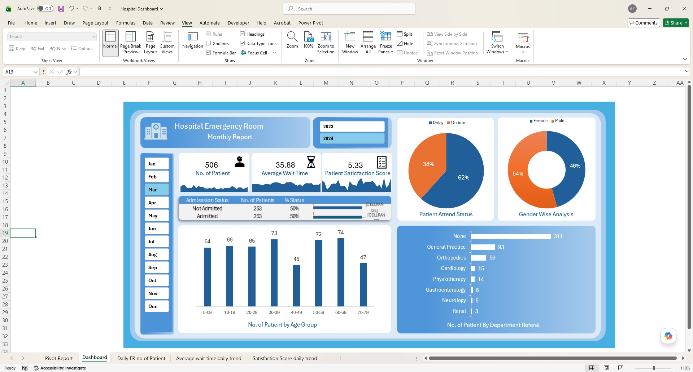

# 🏥 Hospital Emergency Room (ER) Operational Insight Dashboard

## 🎯 Project Overview & Purpose
The Emergency Room is a highly volatile environment where operational bottlenecks directly impact patient satisfaction and care quality. The purpose of this project is to improve ER efficiency and provide actionable insights for healthcare stakeholders. This dashboard empowers hospital management to monitor, analyze, and make data-driven decisions for managing patient inflow and optimizing resource allocation.

---

## 🖥️ Live Dashboard Preview

---

## 🛠️ Technical Architecture & Tools Used

### 1. Data ETL & Extraction (Power Query)
* **Data Cleaning:** Imported messy healthcare datasets, resolved formatting inconsistencies, and ran strict data profiling checks to eliminate missing fields.
* **M Code Automation:** Authored a custom, dynamic `Calendar Table` using functional **M Code** inside the Power Query Advanced Editor to enable deep time-intelligence tracking.

### 2. Data Modeling & Advanced Analytics (Power Pivot)
* **Data Modeling:** Loaded the cleaned data streams into the Power Pivot internal Data Model, establishing robust relational star-schema connections.
* **DAX Calculations:** Engineered custom calculated columns and explicit measures using **DAX (Data Analysis Expressions)** to build complex business logic, including:
  * Dynamic **Age Group** segmentation (e.g., 0-9, 10-19, etc.).
  * Patient status grouping (**Admitted vs. Non-Admitted**).
  * Timeliness analysis (**On-Time vs. Delayed** patient attention rates).

---

## 📊 Core Business KPIs Addressed

* **1. Total Patient Census:** Tracks the absolute number of patients entering the ER daily. It includes an integrated **Area Sparkline** right beneath the KPI card to map real-time daily volume trends and easily isolate seasonal peaks.
* **2. Average Wait Time:** Computes the exact duration a patient spends waiting before being attended to by a medical professional, exposing throughput bottlenecks.
* **3. Patient Satisfaction Score:** Calculates the daily average satisfaction ratings. Paired with a dedicated **Area Sparkline**, this metric allows stakeholders to spot instant drops in service quality and correlate them directly with peak-volume challenges.
* **4. Demographic & Referral Routing:** Provides multidimensional breakdowns by **Gender**, **Age Distribution**, and **Department Referrals** (e.g., General Practice, Orthopedics, Cardiology) to monitor patient routing.

---

## 📥 How to Explore the Interactive Model
Since this dashboard utilizes advanced Power Pivot and Data Modeling features, it requires desktop Excel to interact with slicers.
1. Click the **`.xlsx`** file listed at the top of this repository.
2. Click the **Download** button on the right side to save the workbook locally.
3. Open the file in Microsoft Excel, ensure you "Enable Content/Macros" if prompted, and use the interactive Month/Year slicers on the left rail to filter data.
